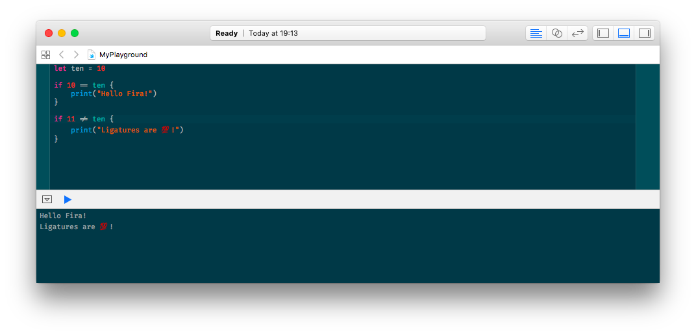

# Solarized Fira
Solarized Dark for Xcode theme variation using Fira Code font.

#Installation
1. Install magnificent [Fira Code](http://github.com/tonsky/FiraCode) font.
2. Put `Solarized Fira.dvtcolortheme` (for Xcode 7) and/or `Solarized Fira.xccolortheme` (for Xcode 8) in `~/Library/Developer/Xcode/UserData/FontAndColorThemes/`.
3. Restart Xcode so it can load new themes.
4. Choose the theme in Xcode -> Preferences -> Fonts & Colors.

##Credits
This is a font-modified [Solarized Dark for Xcode](https://github.com/ArtSabintsev/Solarized-Dark-for-Xcode) theme by Art Sabintsev and he should take all the credits for this great theme 🙌 No color changes has been made to the original theme.
